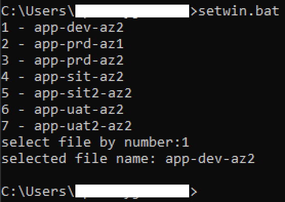
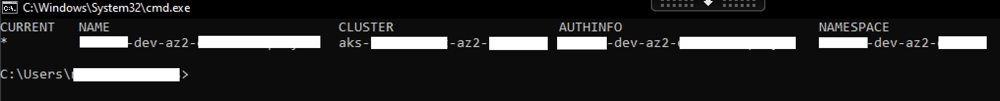

# kubeconfig-tool

This is a tool to set-contexts when you have multiple  kubeconfig files.

## Installation

1. Git clone project to your environment:

    ```bash
    git clone https://github.com/nghyjohn/kubeconfig-tool.git
    ```

2. Copy your kubeconfig files to folder `kubeconfig`:

    For Windows:

    ```batch
    cd kubeconfig-tool
    copy <kubeconfig-file> kubeconfig
    ```

## Usage

> **_NOTE:_**  Make sure kubectl tool is available in your environment.

* For Windows:

    ```batch
    setwin.bat
    ```

Input an integer and press enter to select target kubeconfig file:



A new cmd window will be prompted, and contexts has been setted:

